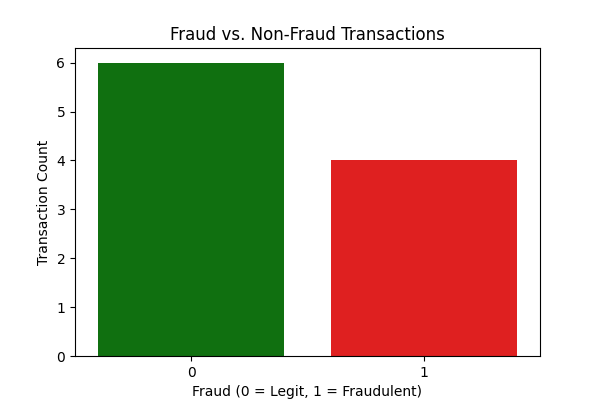
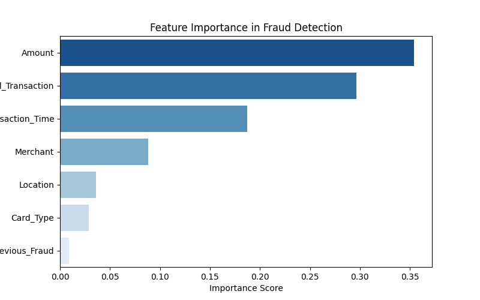

# 🔍 Fraud Detection in Financial Transactions

## 📌 Project Overview
Fraud detection is a critical problem in financial transactions, where fraudulent activities must be identified and prevented. This project uses **machine learning models** to detect fraudulent transactions based on transaction data, analyzing key factors contributing to fraud.

## 🚀 Key Features
- **Fraud vs. Non-Fraud Transaction Analysis** → Understand the distribution of fraudulent activities.
- **Feature Importance Analysis** → Identifies the key factors influencing fraud detection.
- **Machine Learning Model (Random Forest)** → Trained to classify transactions as fraudulent or non-fraudulent.
- **Data Visualization** → Uses Matplotlib & Seaborn to generate insightful charts.

## 🏗️ Technologies Used
- **Python** → Data processing and model training.
- **pandas** → Data wrangling and manipulation.
- **scikit-learn** → Machine learning model training.
- **matplotlib & seaborn** → Data visualization.

## 📂 Folder Structure
```
Fraud_Detection_Project/
│── data/
│   ├── transactions.csv   # Dataset file
│── images/
│   ├── fraud_distribution.png   # Visualization of fraud vs. non-fraud transactions
│   ├── feature_importance.png   # Key factors affecting fraud detection
│── scripts/
│   ├── fraud_detection.py   # Python script for ML analysis
│── README.md   # Project documentation
│── requirements.txt   # Python dependencies
```

## 📥 Installation & Setup
To run this project on your local system:

1. **Clone the Repository**
   ```bash
   git clone https://github.com/VIGNESH54/Fraud_Detection_Project.git
   cd Fraud_Detection_Project
   ```
2. **Create & Activate Virtual Environment**
   ```bash
   python3 -m venv venv
   source venv/bin/activate  # macOS/Linux
   venv\Scripts\activate  # Windows
   ```
3. **Install Dependencies**
   ```bash
   pip install -r requirements.txt
   ```
4. **Run the Analysis Script**
   ```bash
   python scripts/fraud_detection.py
   ```

## 📊 Sample Output & Insights
### **1️⃣ Fraud vs. Non-Fraud Transactions**

- Shows the proportion of legitimate vs. fraudulent transactions.

### **2️⃣ Feature Importance in Fraud Detection**

- Highlights the most important transaction features used in fraud detection.

## 🎯 Business Impact
This analysis helps businesses:
- **Detect fraudulent transactions** and reduce financial losses.
- **Improve fraud prevention strategies** by analyzing key fraud indicators.
- **Enhance security** in financial transactions.

## 🤝 Contribution
Feel free to fork this project, submit pull requests, or reach out for collaborations.

## 📞 Contact
**GitHub:** [VIGNESH54](https://github.com/VIGNESH54)  
**Email:** vignesh23557@gmail.com

